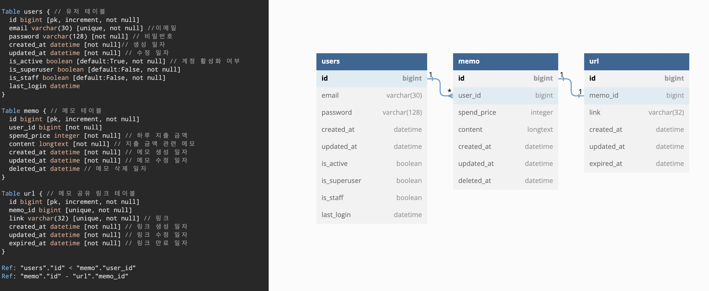

# 프로젝트 목표
인증된 유저에 한해 가계부에 메모를 생성, 수정, 삭제, 조회 및 공유할 수 있는 REST API를 제공합니다.

# 사용 기술 및 환경
- Python 3.9
- Django 4.1.4
- MySQL 5.7

# 프로젝트 주요 구조
```text
PayHere
├── ...
├── README.md // 프로젝트 내용 설명 파일
├── account_books // 가계부 앱
├── accounts // 계정 관리(회원가입, 로그인, 로그아웃) 앱
├── config // 프로젝트를 위한 파이썬 패키지들이 저장되는 디렉토리
└── table.DDL // DB 관련 테이블에 대한 DDL 파일 
```

# 사용 방법
### 실행 시키기
```bash
# 코드 받아서 띄우기
git clone https://github.com/rla-thdus/PayHere.git
cd PayHere
docker-comopse up -d
```

### 테스트 코드 동작 시키기
```bash
docker exec -it service /bin/bash
python manage.py test
```

# 데이터베이스 ERD


# 기능 설명
- https://documenter.getpostman.com/view/22668733/2s8Z6vYtrf
- **[회원 가입]**
  - [POST] `/accounts/registration`
  - 회원 가입을 할 수 있습니다.
  - 다음과 같은 값은 `Request Body`에 반드시 필요합니다.
    - `email`
    - `password`
  - 이미 존재하는 `email`이 있다면 `BAD REQUEST`를 반환합니다.
- **[로그인]**
  - [POST] `/accounts/login`
  - 로그인을 할 수 있습니다.
  - 다음과 같은 값은 `Request Body`에 반드시 필요합니다.
    - `email`
    - `password`
  - 이메일이 존재하지 않거나 패스워드가 일치하지 않을 경우 `BAD REQUEST`를 반환합니다.
  - 로그인에 성공하면 `access`, `refresh` 토큰을 반환합니다.
- **[로그아웃]**
  - [DELETE] `/accounts/logout`
  - 인증된 유저에 한해 로그아웃을 할 수 있습니다.
  - 인증 안된 유저의 요청에는 `Unauthorized`를 반환합니다.
  - 로그아웃에 성공하면 `Accepted`를 반환합니다.
- **[토큰 재발급]**
  - [POST] `/accounts/token/refresh`
  - 다음과 같은 값은 `Request Body`에 반드시 필요합니다.
    - `refresh`: 유효한 `refresh` 토큰 값을 넣어줘야 합니다.
  - 재발급에 성공시 `access` 토큰을 반환합니다.
- **[토큰 검증]**
  - [POST] `/accounts/token/verify`
  - 다음과 같은 값은 `Request Body`에 반드시 필요합니다.
    - `token`: `access` 토큰 값을 넣어줘야 합니다.
  - 아직 만료되지 않은 토큰이라면 `OK`를 반환합니다.
  - 유효하지 않은 토큰이라면 `UNAUTHROIZED`를 반환합니다.
- **[메모 작성]**
  - [POST] `/account_books/memos`
  - 인증된 유저에 한해 메모를 작성할 수 있습니다.
  - 다음과 같은 값은 `Request Body`에 반드시 필요합니다.
    - `spend_price`
    - `content`
  - 유효성 검증에 실패하면 `BAD REQUEST`를 반환합니다.
- **[메모 전체 조회]**
  - [GET] `/account_books/memos?page={page}&order_by={order_by}`
  - 인증된 유저에 한해 자신의 메모 기록을 조회할 수 있습니다.
  - 페이징 기능이 제공됩니다.
    - 10개가 기본입니다.
    - `page` 값이 없다면 기본으로 첫번째 페이지를 반환합니다.
  - 정렬 기능이 제공됩니다.
    - 다음과 같은 정렬 옵션(`order_by`)을 사용할 수 있습니다.
      - (기본) 최신 메모 순: `-created_at`
      - 오래된 메모 순: `created_at`
      - 높은 당일 지출 금액 순: `-spend_price`
      - 낮은 당일 지출 금액 순: `spend_price`
      - 옵션이 존재하지 않는다면 **최신 메모 순**으로 정렬됩니다.
- **[메모 상세 조회]**
  - [GET] `/account_books/memos/{memo_id}`
  - 인증된 유저에 한해 자신의 메모의 상세 내용을 조회할 수 있습니다.
  - 해당 `memo_id`가 없을 경우 `NOT FOUND`를 반환합니다.
  - 해당 메모가 자신의 것이 아닌 경우 `FORBIDDEN`을 반환합니다.
- **[메모 수정]**
  - [PATCH] `/account_books/memos/{memo_id}`
  - 인증된 유저에 한해 자신의 메모의 내용을 수정할 수 있습니다.
  - 다음과 같은 값을 `Request Body`에 선택적으로 넣어 수정할 수 있습니다.
    - `spend_price`
    - `content`
  - 해당 `memo_id`가 없을 경우 `NOT FOUND`를 반환합니다.
  - 해당 메모가 자신의 것이 아닌 경우 `FORBIDDEN`을 반환합니다.
- **[메모 복제]**
  - [POST] `/account_books/memos/{memo_id}`
  - 인증된 유저에 한해 자신의 메모를 복제할 수 있습니다.
  - 해당 `memo_id`가 없을 경우 `NOT FOUND`를 반환합니다.
  - 해당 메모가 자신의 것이 아닌 경우 `FORBIDDEN`을 반환합니다.
- **[메모 삭제]**
  - [DELETE] `/account_books/memos/{memo_id}`
  - 인증된 유저에 한해 자신의 메모를 삭제할 수 있습니다.
  - 해당 `memo_id`가 없을 경우 `NOT FOUND`를 반환합니다.
  - 해당 메모가 자신의 것이 아닌 경우 `FORBIDDEN`을 반환합니다.
  - 삭제시 메모의 `deleted_at` 필드에 현재 날짜와 시간을 넣어줍니다.
- **[메모 공유 링크 생성]**
  - [POST] `/account_books/share/memos/{memo_id}`
  - 인증된 유저에 한해 자신의 메모를 공유하기 위한 링크를 생성할 수 있습니다.
  - 해당 `memo_id`가 없을 경우 `NOT FOUND`를 반환합니다.
  - 해당 메모가 자신의 것이 아닌 경우 `FORBIDDEN`을 반환합니다.
  - 공유 링크 생성 시간을 기준으로 15분뒤 만료됩니다.
- **[메모 공유 링크 접속]**
  - [GET] `/{shared_link}`
  - 유효한 공유된 링크를 가지고 있는 누구나 해당 메모의 내용을 볼 수 있습니다.
  - 공유된 링크가 만료됐을 때 `NOT FOUND`를 반환합니다.


